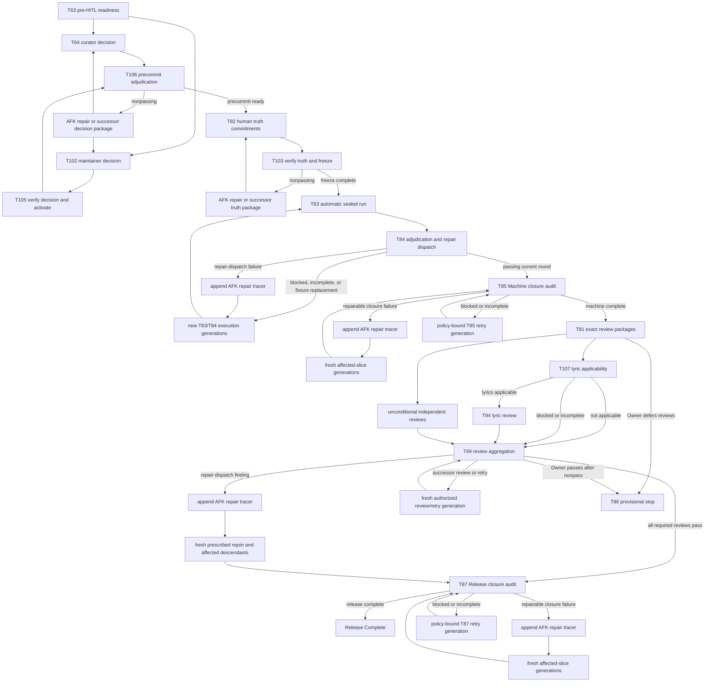

# Instrument Intelligence execution plan

Status: bootstrap-active — only tracer 01 has an eligible initial execution declaration

Authority: [SPEC.md](../../SPEC.md)

## Outcome

Deliver Vellum's complete source-backed instrument-intelligence loop: safe reference ingestion, reviewed and explicitly activated knowledge, voice- and relationship-aware phrase planning, coequal idiomatic compilers for five-course baroque guitar, thirteen-course baroque lute, and six-string classical guitar, independent evaluation, governed learning, and honestly distinct Machine Complete, Release Complete, and provisional stopping states.

This committed base graph contains 107 stable tracer IDs. IDs are append-only locators, not sequence numbers. Each issue's `Initial execution eligibility` scalar records the bootstrap snapshot only; dependencies, typed result predicates, temporal generations, invalidations, and remote-reachability evidence compute current runtime eligibility. Remediation begins with the next transactionally allocated unused ID and never renumbers prior issues or evidence.

## Goal judge

This wave satisfies its goal only at **Release Complete**, when:

- tracer 01's clause-level ledger maps every normative SPEC clause to separate implementation owners, evidence contributors, closure verifiers, exact definition/evidence digests, and current compatibility;
- every required implementation, browser, evaluation, rendering, playback, security, migration, rights, provider, performance, and real-tool gate passes;
- the current sealed non-Greensleeves qualification satisfies every precommitted target/shared-contract/optical coverage class without exposing evaluator-only material;
- every required exact-artifact review is independently current, scope-authorized, and bound to unchanged bytes;
- no required dimension is failed, blocked, incomplete, unknown, stale, incomparable where comparison is mandatory, or supported only by test-only authority; and
- every dependency implementation commit and evidence receipt is observed reachable from `origin/main` before dependent work begins.

Machine Complete is a provisional non-human closure established only by a current T85 `machine_complete` result. A finalized nonpassing T85 audit records or dispatches remediation but cannot create that state. T86 may record an explicit Owner decision to stop provisionally, but neither state satisfies the goal. Release Complete is established only by a current T87 `release_complete` result; a finalized nonpassing T87 audit records or dispatches remediation without satisfying the goal.

## State separation

Tracer completion and product acceptance are independent:

- `implementation-pass` requires the tracer's implementation and gates to pass;
- `attempt-finalized` completes when an immutable run or review attempt is recorded, even when its product result is failed, blocked, or incomplete;
- `decision-recorded` completes when the authorized human decision is immutable; downstream predicates decide whether it is sufficient; and
- `closure-pass-required` completes only when every non-compensating closure predicate passes.

A failed attempt may make remediation eligible. It can never satisfy Machine Complete or Release Complete.

## User stories

- **U1 — Trusted references:** ingest a selected PDF or local source with durable identity, rights, provenance, citations, and safe processing.
- **U2 — Reviewed knowledge:** extract, review, version, activate, inspect, reassess, and retire source-backed instrument knowledge without conflating evidence lanes.
- **U3 — Musical understanding:** preserve source voices, harmony, relationships, figures, text, context, and phrase obligations before choosing fingerings.
- **U4 — Baroque guitar:** produce playable, idiomatic punteado, rasgueado, alfabeto, or mixed-style output with truthful continuo disposition.
- **U5 — Baroque lute:** produce playable thirteen-course output with calibrated left/right-hand mechanics, diapasons, and correct French tablature/playback identity.
- **U6 — Classical guitar:** produce coherent multi-voice standard notation and playback with joint left/right-hand realization.
- **U7 — Cross-domain intelligence:** realize continuo and imitative counterpoint through shared contracts without flattening their distinct relationships.
- **U8 — Independent evaluation:** grade generation outside its visibility, preserve failures, and make narrow, reproducible qualification claims.
- **U9 — Guided ownership:** guide upload-to-output, expose expert detail, support interactive selection/manual versions/recovery, and turn feedback into reviewable proposals.
- **U10 — Auditable release:** remain secure, rights-safe, performant, resumable, reviewable, and honest about uncertainty and authority.

## Tracer queue

### Phase A — Bootstrap and pre-observation guards

Tracer 01 is the only issue whose initial execution declaration is `eligible`. After it passes, provider, rights, performance-policy, publication, and confidentiality work may become runtime-eligible according to their dependencies; their immutable initial declarations do not change.

|  ID | Tracer                                                    | Type | Blocked by         | Stories     |
| --: | --------------------------------------------------------- | ---- | ------------------ | ----------- |
|   1 | Governance bootstrap and requirement-ledger verifier      | AFK  | —                  | U10         |
|   2 | Server-minted provider boundary                           | AFK  | T01                | U1, U10     |
|   3 | Rights-safe tracked-source quarantine                     | AFK  | T01                | U1, U2, U10 |
|   4 | Release-floor derivation policy and gate-matrix schema    | AFK  | T01                | U10         |
|  70 | Clean baseline and release-floor publication              | AFK  | T04                | U10         |
|  71 | Early evaluator and private-data leak canaries            | AFK  | T01                | U1, U8, U10 |
|   5 | Versioned source identity and rights graph                | AFK  | T01, T03           | U1, U2      |
|   6 | Shared assets, acquisition provenance, and deletion       | AFK  | T05                | U1, U2, U10 |
|   7 | Transactional publication generations                     | AFK  | T01                | U2, U10     |
|   8 | Authority-path inventory and compatibility classification | AFK  | T03                | U2, U10     |
|   9 | Transactional OwnerReference migration and quarantine     | AFK  | T05, T06, T07, T08 | U1, U2, U10 |
|  10 | Migrated-private defaults and Workbench proof             | AFK  | T02, T09           | U1, U2, U9  |

### Phase B — Knowledge, source, and evaluation foundations

The eight primary-source verticals may run in parallel after reviewer/attestation infrastructure exists. Their test-only releases remain inactive by default.

|  ID | Tracer                                                                 | Type | Blocked by    | Stories            |
| --: | ---------------------------------------------------------------------- | ---- | ------------- | ------------------ |
|  11 | Mace Page Atlas and cited-segment browser path                         | AFK  | T02, T06, T10 | U1, U2, U9         |
|  12 | Typed knowledge evidence and immutable release                         | AFK  | T07, T11      | U2                 |
|  13 | Reviewer credential, scope, expiry, and revocation authority           | AFK  | T12           | U2, U10            |
|  14 | Complete catalog, manifest, and provisional consequence                | AFK  | T08, T12, T13 | U2, U9, U10        |
|  15 | Transactional resolver cutover                                         | AFK  | T09, T14      | U2, U10            |
|  16 | Synthetic authority and ordinary-activation isolation                  | AFK  | T15           | U2, U9, U10        |
|  17 | Evaluation status and comparison migration                             | AFK  | T01, T07, T71 | U8, U10            |
|  18 | Sealed evaluator process boundary                                      | AFK  | T02, T17, T71 | U8, U10            |
|  19 | Encrypted Evaluation Vault lifecycle                                   | AFK  | T07, T18, T71 | U8, U10            |
|  20 | Public/Vault split and repository leak enforcement                     | AFK  | T19, T71      | U8, U10            |
|  21 | Split manifests, attempt ledger, and inherited regressions             | AFK  | T17, T19, T20 | U8, U10            |
|  22 | Qualification scopes, roles, and provider policy                       | AFK  | T13, T21      | U8, U10            |
|  72 | Search Measurement, Selection Policy, and Adoption Decision foundation | AFK  | T17, T22      | U3, U4, U5, U6, U8 |
|  35 | Independent evaluator framework contracts                              | AFK  | T20, T22, T72 | U3, U8, U10        |
|  73 | Sanz ingestion, cited extraction, and test-only release                | AFK  | T13           | U1, U2, U4         |
|  74 | Corbetta ingestion, cited extraction, and test-only release            | AFK  | T13           | U1, U2, U4         |
|  75 | Gasparini ingestion, cited extraction, and test-only release           | AFK  | T13           | U1, U2, U7         |
|  76 | Baron ingestion, cited extraction, and test-only release               | AFK  | T13           | U1, U2, U5         |
|  77 | Perrine ingestion, cited extraction, and test-only release             | AFK  | T13           | U1, U2, U5         |
|  78 | Weiss ingestion, cited extraction, and test-only release               | AFK  | T13           | U1, U2, U5         |
|  79 | Sor text and plates ingestion with test-only release                   | AFK  | T13           | U1, U2, U6         |
|  80 | Carulli aligned reduction ingestion and test-only release              | AFK  | T13           | U1, U2, U6         |

### Phase C — Shared musical understanding and cross-domain verticals

Shared plans and evaluator contracts precede target realization. Interactive editing is a separate complete Workbench vertical rather than part of Adoption Decision storage.

|  ID | Tracer                                                             | Type | Blocked by                   | Stories        |
| --: | ------------------------------------------------------------------ | ---- | ---------------------------- | -------------- |
|  23 | Source Voice Graph vertical                                        | AFK  | T10, T17, T35                | U3             |
|  24 | Time-varying context and exact Transposition vertical              | AFK  | T23                          | U3             |
|  25 | Lyric Underlay vertical                                            | AFK  | T23                          | U3             |
|  26 | Canonical spanner and ornament vertical                            | AFK  | T23, T24                     | U3             |
|  27 | Target Voice Plan vertical                                         | AFK  | T23, T24                     | U3             |
|  28 | Target Harmonic Plan vertical                                      | AFK  | T27                          | U3             |
|  29 | Target Relationship Plan vertical                                  | AFK  | T27, T28                     | U3, U7         |
|  30 | Continuo Plan and Disposition contract                             | AFK  | T29                          | U3, U7         |
|  31 | Intended Technique Plan vertical                                   | AFK  | T29                          | U3, U4, U5, U6 |
|  32 | Instrument Instance calibration and Workbench path                 | AFK  | T10, T23                     | U4, U5, U6, U9 |
|  33 | Phrase- and work-level bounded search                              | AFK  | T27, T28, T29, T30, T31, T32 | U3, U4, U5, U6 |
|  34 | Candidate mapping and gated Adoption Decision                      | AFK  | T17, T22, T33                | U3, U4, U5, U6 |
|  36 | Optical figured-bass truth vertical                                | AFK  | T30                          | U3, U7         |
|  37 | Source-backed cembalo realization                                  | AFK  | T14, T16, T34, T36, T75      | U3, U7         |
|  38 | Honest Continuo disposition branches                               | AFK  | T30, T37                     | U3, U7         |
|  39 | Continuo mutation and development acceptance                       | AFK  | T35, T38                     | U3, U7, U8     |
|  40 | Three-voice imitative Golden vertical                              | AFK  | T14, T29, T34, T35           | U3, U7         |
|  41 | Imitative mutation and development acceptance                      | AFK  | T35, T40                     | U3, U7, U8     |
|  99 | Interactive note selection, prompting, batch edits, and versioning | AFK  | T02, T10, T34                | U1, U2, U9     |

### Phase D — Coequal target compiler development

Baroque guitar, baroque lute, and classical guitar are sibling chains. Immutable bad artifacts remain permanent failures; separate generative regressions prove repaired behavior.

|  ID | Tracer                                                   | Type | Blocked by              | Stories |
| --: | -------------------------------------------------------- | ---- | ----------------------- | ------- |
|  42 | Baroque-guitar known-bad rejection                       | AFK  | T32, T34, T35           | U4, U8  |
|  43 | Exact punteado repair                                    | AFK  | T16, T42, T73           | U2, U4  |
|  44 | Rasgueado, alfabeto, and constituent-string vertical     | AFK  | T43, T74                | U2, U4  |
|  45 | Mixed-style phrase vertical                              | AFK  | T44                     | U4      |
|  46 | Honest baroque-guitar Continuo disposition               | AFK  | T38, T45                | U4, U7  |
|  47 | Baroque-guitar development acceptance                    | AFK  | T35, T46                | U4, U8  |
|  48 | Baroque-lute known-bad rejection                         | AFK  | T32, T34, T35           | U5, U8  |
|  49 | Calibrated baroque-lute left-hand repair                 | AFK  | T11, T16, T48, T76, T77 | U2, U5  |
|  50 | Whole-instrument right hand and diapasons                | AFK  | T49, T78                | U5      |
|  51 | Baroque-lute Golden engraving and playback               | AFK  | T35, T50                | U5, U8  |
|  52 | Baroque-lute development acceptance and course-13 claims | AFK  | T51                     | U5, U8  |
|  53 | Classical-guitar known-bad rejection                     | AFK  | T32, T34, T35           | U6, U8  |
|  54 | Coherent classical voice and harmonic reduction          | AFK  | T16, T29, T53, T79, T80 | U2, U6  |
|  55 | Joint-hand standard-notation vertical                    | AFK  | T54                     | U6      |
|  56 | Classical-guitar development acceptance                  | AFK  | T35, T55                | U6, U8  |

### Phase E — Learning, lifecycle, performance, and real E2E readiness

Advisory diffing, deletion/purge, interruption/resume, and legacy regeneration are separate verticals. Tracer 63 audits all pre-HITL work and prepares commitments without choosing held-out Works.

|  ID | Tracer                                                     | Type | Blocked by                                                 | Stories                |
| --: | ---------------------------------------------------------- | ---- | ---------------------------------------------------------- | ---------------------- |
|  57 | Reassessment and governed learning proposals               | AFK  | T15, T16, T21, T34, T47, T52, T56                          | U2, U8, U9             |
|  58 | Workbench release, attestation, and advisory diff          | AFK  | T06, T10, T57                                              | U1, U2, U9             |
|  96 | Rights restriction, deletion, and derivative purge         | AFK  | T06, T19, T20, T58                                         | U1, U2, U9             |
|  97 | Interruption, reload, and exact resume                     | AFK  | T10, T21, T33, T58                                         | U1, U8, U9             |
|  98 | Legacy inspection and canonical regeneration               | AFK  | T06, T10, T14, T34, T58                                    | U1, U2, U9             |
|  59 | Search and release-floor performance acceptance            | AFK  | T04, T70, T33, T39, T41, T47, T52, T56, T97                | U8, U10                |
|  60 | Cross-domain evaluator and parity closure                  | AFK  | T21, T22, T25, T26, T39, T41, T47, T52, T56                | U3, U4, U5, U6, U7, U8 |
|  61 | Synthetic sealed-qualification drill                       | AFK  | T21, T22, T59, T60                                         | U8, U10                |
|  62 | Real PDF-to-three-target Guided Start E2E                  | AFK  | T47, T52, T56, T58, T59, T60, T96, T97, T98, T99           | U1, U4, U5, U6, U9     |
|  63 | Pre-HITL audit, independent review packages, and interlock | AFK  | T15, T16, T20, T39, T41, T58, T61, T62, T96, T97, T98, T99 | U8, U9, U10            |

### Phase F — Late commitments and automatic machine qualification

T64, T102, and T82 are human decisions only. T105/T106 verify and adjudicate the curator/maintainer generations; T103 verifies truth and freezes the system. Every nonpass has an AFK repair/successor route. The sealed run, adjudication/remediation, Machine Complete judgment, and package builder remain AFK.

|  ID | Tracer                                                      | Type | Blocked by | Stories                                 |
| --: | ----------------------------------------------------------- | ---- | ---------- | --------------------------------------- |
|  64 | Independent held-out curator precommit                      | HITL | T63        | U4, U5, U6, U7, U8, U10                 |
| 102 | Maintainer decision over ordinary nonhistorical activation  | HITL | T63        | U2, U9, U10                             |
| 105 | Maintainer-decision verification and ordinary activation    | AFK  | T102       | U2, U9, U10                             |
| 106 | Precommit adjudication and successor-decision routing       | AFK  | T64, T105  | U2, U4, U5, U6, U7, U8, U10             |
|  82 | Independent truth-review commitments                        | HITL | T106       | U3, U4, U5, U6, U7, U8, U10             |
| 103 | Truth verification, system freeze, and sealed-run interlock | AFK  | T82, T106  | U3, U4, U5, U6, U7, U8, U10             |
|  83 | Automatic sealed qualification run                          | AFK  | T61, T103  | U3, U4, U5, U6, U7, U8, U10             |
|  84 | Qualification adjudication and remediation dispatch         | AFK  | T83        | U3, U4, U5, U6, U7, U8, U10             |
|  85 | Machine closure adjudication and remediation dispatch       | AFK  | T84        | U1, U2, U3, U4, U5, U6, U7, U8, U9, U10 |
|  81 | Post-qualification exact-artifact review package            | AFK  | T85        | U1, U2, U3, U4, U5, U6, U7, U8, U9, U10 |

### Phase G — Independent artifact reviews and release closure

Review tracers finalize independent pass/fail/blocked/incomplete attestations. T69 aggregates the round and routes repairs; T87 alone can establish Release Complete. T86 is an optional provisional stopping decision and never satisfies the goal.

|  ID | Tracer                                                | Type | Blocked by                                                                    | Stories                                 |
| --: | ----------------------------------------------------- | ---- | ----------------------------------------------------------------------------- | --------------------------------------- |
| 107 | Lyric-review applicability adjudication               | AFK  | T81                                                                           | U3, U8, U10                             |
|  65 | Baroque-guitar physical target-player review          | HITL | T81                                                                           | U4, U8, U10                             |
|  66 | Baroque-lute physical target-player review            | HITL | T81                                                                           | U5, U8, U10                             |
|  67 | Classical-guitar physical target-player review        | HITL | T81                                                                           | U6, U8, U10                             |
|  68 | Metadata and rights review                            | HITL | T81                                                                           | U1, U2, U3, U8, U10                     |
|  88 | Baroque-guitar idiom and historical review            | HITL | T81                                                                           | U2, U4, U8, U10                         |
|  89 | Baroque-lute idiom and historical review              | HITL | T81                                                                           | U2, U5, U8, U10                         |
|  90 | Classical-guitar idiom review                         | HITL | T81                                                                           | U2, U6, U8, U10                         |
|  91 | Continuo exact-artifact review                        | HITL | T81                                                                           | U3, U7, U8, U10                         |
|  92 | Imitative-intabulation exact-artifact review          | HITL | T81                                                                           | U3, U8, U10                             |
|  93 | Engraving and playback editorial review               | HITL | T81                                                                           | U4, U5, U6, U7, U8, U10                 |
|  94 | Conditional lyric-underlay review                     | HITL | T107                                                                          | U3, U8, U10                             |
|  95 | Owner cross-target usefulness review                  | HITL | T81                                                                           | U1, U2, U4, U5, U6, U8, U9, U10         |
| 100 | Source transcription and extraction review            | HITL | T81                                                                           | U1, U3, U8, U10                         |
| 101 | Historical-claim and pack-profile review              | HITL | T81                                                                           | U2, U3, U4, U5, U6, U7, U8, U10         |
| 104 | Source-to-output musical-structure fidelity review    | HITL | T81                                                                           | U3, U4, U5, U6, U7, U8, U10             |
|  69 | Review-round aggregation and remediation routing      | AFK  | T65, T66, T67, T68, T88, T89, T90, T91, T92, T93, T95, T100, T101, T104, T107 | U1, U2, U3, U4, U5, U6, U7, U8, U9, U10 |
|  87 | Release closure adjudication and remediation dispatch | AFK  | T69, T85                                                                      | U1, U2, U3, U4, U5, U6, U7, U8, U9, U10 |
|  86 | Optional Owner provisional-stop decision              | HITL | T81, T85                                                                      | U10                                     |

## Result-sensitive late flow

The graph distinguishes finalizing an attempt from passing it. T103, T105, T106, T84, T85, T107, T69, and T87 always retain the observed generation, route nonpassing outcomes, and require fresh human or automatic generations as appropriate. T84/T85/T69/T87 allocate append-only remediation IDs only for repair-dispatch outcomes and invalidate affected evidence; blocked/incomplete retry or human-successor outcomes cannot masquerade as repairs. A blocked or incomplete T107 result enters T69 without opening T94. Runtime reruns are an immutable temporal DAG keyed by `(tracer ID, execution generation)`; they may revisit one static tracer definition without creating a definition-graph cycle. Machine Complete and Release Complete exist only for the exact current passing T85 and T87 result codes.

## Safe concurrency

- After T01, T02, T03, T04, T07, and T71 may progress independently.
- After T13, T73–T80 are independent source verticals with separate assets, rights decisions, citations, releases, and evidence.
- Source/migration work and evaluator/Vault work may overlap only after the early T71 guard and their declared blockers land.
- Continuo, imitative counterpoint, and the three target known-bad cases may progress independently after shared contracts.
- Baroque guitar, baroque lute, and classical guitar remain coequal sibling chains; no target is another target's prerequisite.
- T65–T68, T88–T93, T95, T100–T101, and T104 may run in parallel over unchanged T81 packages with separate reviewer capabilities; T94 joins only after T107 records `lyrics_applicable`. T107 `lyrics_not_applicable`, `lyrics_applicability_blocked`, or `lyrics_applicability_incomplete` routes directly to T69, and the latter two force remediation rather than a lyric-review fiction.
- Shared Podman, Audiveris, fixed ports, Vault writers, mutable stores, and performance hardware are always serialized by resource leases even when implementation work is parallel.

## Execution rules

1. Immediately before beginning a tracer, record a start receipt containing its definition digest, blocker commits/evidence generations, result predicates, and observed `origin/main` reachability.
2. Begin every implementation tracer with its named failing output- or contract-level case.
3. Keep each tracer a narrow complete path through every applicable persistence, service, API, UI, render/playback, and evaluator boundary.
4. Record focused evidence under `evidence/TNN/verification.json` and reference only rights-approved public artifacts or typed non-resolving private receipts. A rerun replaces that canonical working path in a new commit; verification of every older generation reads its immutable evidence and artifacts from that generation's reachable commit.
5. Run the base gates plus every applicable conditional gate in the issue. `not_applicable` requires a clause-specific rationale.
6. Rebase/reconcile onto current `main`, rerun affected and base gates, commit and push implementation plus canonical typed evidence, then append the receipt naming that reachable commit, regenerate the manifest, commit and push the receipt transaction, and pass strict origin-equality verification before dependent work starts.
7. Never weaken an accepted invariant, evaluator, mutation, regression, or review requirement to obtain a pass.
8. A finalized failed evaluation/review attempt is preserved and may unblock remediation, but it never advances a closure-pass predicate.
9. A valid held-out failure remains in the attempt ledger and enters development only through an explicit rights-checked declassification transaction that updates exposure and contamination state.
10. Remediation transactionally allocates the next unused numeric ID under a compare-and-swap registry head, appends only its new issue and PLAN row while every prior definition and authority narrative remains byte-stable, and binds the repair to an exact typed dispatch artifact emitted by T69, T84, T85, T87, T103, or T106. The dispatch prescribes the finding, actual invalidation edges/scopes, earliest safe rejoin point, and closure targets; the repair cannot self-declare weaker obligations. Deleted definitions require retained tombstones; IDs are never reused, and tombstoning or superseding a dynamic repair cannot erase any historical closure obligation.
11. Only the next precommitted reserve group may replace an independently invalidated fixture; output-dependent invalidation and convenient reserve selection are forbidden.
12. Parallel implementation uses isolated worktrees/branches and declared ownership. Integration/push is serialized, and evidence binds the final remote-reachable commit.
13. Shared real-tool locks remain until their owning process is proven absent; orphan cleanup and clean rerun are recorded.
14. Every rerun appends a temporal node keyed by `(tracer ID, execution generation)` with exact predecessor generations, closed-schema result receipts, and typed supersession/invalidation edges. Each remediation generation has dispatcher-bound `rejoinAt`, actual bounded invalidation edges/scopes, a derived `invalidatesMachineComplete`, and nonempty `closureTargets`. The repair reserves those exact future identities; an unresolved reservation is allowed only while closure remains pending and makes it ineligible. Once materialized, the rejoin is a strict descendant of the repair and each target descends from the rejoin. Current T85/T87 must equal or strictly descend from the targets of every historical remediation generation, including superseded or tombstoned generations. T87 is always targeted; T85 is targeted exactly when actual scope reaches Machine Complete. Static definitions remain immutable and acyclic. For an OR predicate, execution descends from one actually satisfied branch, not the union of alternatives.

## Bootstrap and manifest rules

The committed schema-5 manifest begins in `bootstrap_pending` and is deliberately execution-locked and evidence-empty. It cannot certify T01 or any later tracer. T01 first atomizes this requirement-family index and all adversarial requirements in its issue into clause-level records, installs the upgraded evidence/obligation/trust verifier, and regenerates an empty next-schema manifest in a governance-only pre-registration commit. That commit must be pushed and strictly verified before T01 begins its ordinary implementation/evidence commit and manifest-only receipt commit. Until the upgrade, family mappings are planning coverage only and `evidence/` contains only `.gitkeep`.

Run:

- `npm run plan:instrument-intelligence:manifest` after any tracker definition or receipt change;
- `npm run spec:verify` before committing a draft;
- `npm run plan:instrument-intelligence:trust-bootstrap` exactly once, after the Owner independently verifies the pushed unprogressed bootstrap and protected linear-main policy;
- for T01 only, push and strictly verify the governance-only pre-registration transaction before producing any evidence;
- push implementation/evidence before creating its receipt, then push the separate receipt-manifest commit; and
- `npm run plan:instrument-intelligence:verify` after push for strict byte equality with `origin/main`.

The manifest enumerates every issue, typed dependency/result predicate, definition digest, closed evidence schema, authority snapshot, implementation commit, remote-reachability receipt, immutable registry/tombstone prefix, typed invalidation/supersession edge, and temporal execution node. Closure and wave status are derived from current active receipts plus cumulative dynamic obligations rather than copied from editable fields. Acceptance, applicability, comparison, freshness, issue completion, and closure remain separate axes. It has no fixed tracer count or AFK/HITL numeric ranges.

## Late human boundary

T63 is the last pre-commitment AFK readiness audit. Human work is deliberately late but not conflated:

- T64 commits held-out curation without truth review or execution.
- T102 records the exact maintainer decision without verification or activation; T105 applies those automatic consequences.
- T106 adjudicates curator/maintainer results and routes every nonpass before truth review.
- T82 records independent truth decisions only; T103 verifies them, freezes the Generation System, and routes every nonpass.
- T83–T85 and T81 resume automatically for qualification, remediation, Machine Complete, and package generation.
- T107 decides lyric applicability without inventing a human N/A; role-scoped review attempts remain independent and non-compensating.
- T69 routes every blocking finding through fresh AFK repair and evidence invalidation.
- Only T87 `release_complete` establishes Release Complete; a nonpassing T87 adjudication routes repair or retry, and T86 records only an explicit provisional stop.

This preserves maximum autonomy while keeping every authority-bearing decision and every machine-executable consequence in its proper lane.
