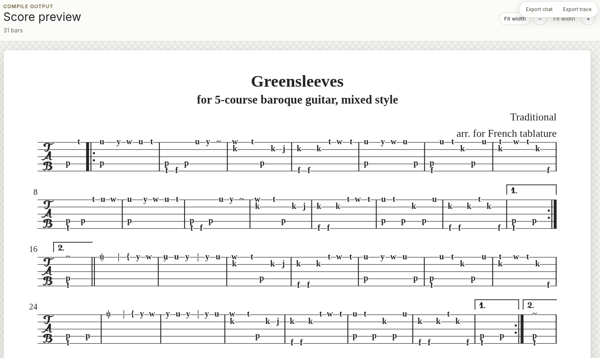

# Vellum

**ve*LLM*um** — an AI music desk for historical plucked strings.

Vellum helps an LLM arrange music for baroque lute, baroque guitar, Renaissance lute, theorbo, classical guitar, piano, and voice. The model makes musical choices; Vellum checks the hard mechanical parts: frets, courses, playable voicings, alfabeto chords, LilyPond syntax, and rendered output.

## Demo

[](https://youtu.be/D3I8bT7nllc)

_“Greensleeves” for soprano and 5-course baroque guitar, engraved with Vellum using historical alfabeto chord shapes. Click the image to watch the demo video. Based on the Mutopia Project source: [`greensleeves_guitar.ly`](https://www.mutopiaproject.org/ftp/Traditional/greensleeves_guitar/greensleeves_guitar.ly)._

## What Vellum does

- Finds valid pitch → course/fret positions with `tabulate`
- Enumerates playable chord shapes with `voicings`
- Looks up historical baroque-guitar alfabeto with `alfabeto_lookup`
- Validates stretches, ranges, and fingering conflicts with `check_playability`
- Generates LilyPond from structured music data with `engrave`
- Compiles LilyPond to SVG/PDF with structured error feedback via `compile`
- Analyzes MusicXML, transposes, checks voice-leading, and renders fretboard diagrams

## Why it exists

LLMs can be useful musical collaborators, but they are bad at guessing instrument mechanics and notation syntax. Vellum gives the agent tools that turn those guesses into checked, playable, engraved music.

## Quick start

```bash
nix develop
npm install
npm run server:build
npm run server
```

In another shell:

```bash
nix develop
npm run dev
```

Then open the Vite URL. Configure an LLM key with `OPENAI_API_KEY`, `ANTHROPIC_API_KEY`, `VELLUM_LLM_API_KEY`, or pi OAuth credentials.

## Stack

- TypeScript + Vite browser UI
- `pi-agent-core` / `pi-web-ui` for the chat agent interface
- Express API server
- LilyPond for engraving
- music21 for analysis helpers
- Nix dev shell with Node, Python, and LilyPond

## Docs

- [SPEC.md](./SPEC.md) — full architecture and tool design
- [ALFABETO-SPEC.md](./ALFABETO-SPEC.md) — historical baroque-guitar chord lookup
- [HISTORICAL-RENDERING-SPEC.md](./HISTORICAL-RENDERING-SPEC.md) — engraving goals
