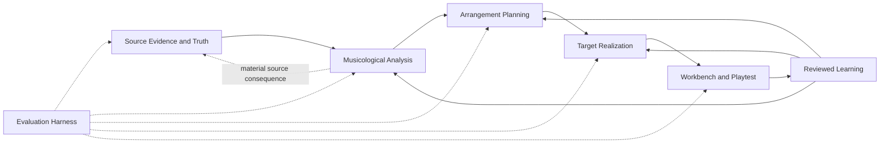

# Vellum Arrangement Intelligence

Status: Draft proposal index

Governing context: `CONTEXT.md` and accepted ADRs in `docs/adr/`

## Product contract

Vellum carries uncertain musical evidence through reviewed understanding, explicit arrangement design, target-specific realization, human verification, and reviewed calibration. Its default promise is that an Owner without specialist arranging expertise can upload a source and receive an arrangement that a real intended performer recognizes, trusts, can play at the declared difficulty and context, and can intelligently revise.

The system is a loop:

Five-course baroque guitar, thirteen-course baroque lute, and six-string classical guitar are coequal initial targets. Equal importance does not require simultaneous implementation, but parity is not complete while any target remains on first-fit or proxy-labeled realization.

## Subordinate specifications

- [Source Truth, Performance Brief, and Arrangement Planning](./source-truth-and-planning.md)
- [Instrument Representation and Musical Constraint Compiler](./instrument-and-compiler.md)
- [Workbench, Playtest, and Reviewed Learning](./workbench-playtest-learning.md)
- [Arrangement Evaluation Harness](./evaluation-harness.md)
- [Tracer-Bullet Delivery and Acceptance](./delivery-plan.md)

These documents divide review ownership. A change to evaluation semantics does not reopen instrument mechanics; a change to course representation does not redefine Source Truth.

## Shared principles

- Source uncertainty cannot be hidden by downstream sophistication.
- Musicological Analysis describes the source; Arrangement Planning decides what Vellum intends to make.
- A playable realization of a weak plan remains a weak arrangement.
- Mechanical certification, ergonomic estimation, historical evidence, Owner preference, and physical playtest remain distinct.
- Synthetic Audio Preview cannot certify physical execution.
- Every target receives an independent Arrangement Search and Preservation Audit.
- Personal choices never silently become Historical Knowledge.
- Complexity belongs in the engine; the default UI surfaces only consequential decisions.
- Evaluation uses hard gates plus multidimensional evidence, never one overall grade.
- Exact snapshots are reserved for identity-sensitive contracts; musical fixtures otherwise define acceptable boundaries.

## Proposed shared terminology

These terms remain draft until accepted into `CONTEXT.md` through focused ADRs.

**Source Truth Assessment**: A versioned determination that an exact Score Transcription and its evidence authorize a stated downstream purpose.

**Performance Brief**: The intended musical use and performer demands for an Arrangement Family, including performer capability, intended tempo or tempo range, preparation context, difficulty intent, technique expectations, notation needs, ensemble role, and reliability goal.

**Intended Performer Profile**: A scoped description of the performer assumed by the Performance Brief. It describes proficiency and technique expectations, not personal anatomy. The Owner Ergonomic Profile separately records Owner-specific capabilities and limitations.

**Arrangement Plan**: A versioned design linking exact source truth and Analysis to work-level and sectional musical intentions before target-specific realization.

**Plan Decision**: A scoped, evidence-bearing choice within an Arrangement Plan.

**Owner Playtest**: Score-anchored evidence of the Owner physically testing an exact result on an exact Instrument Instance Configuration under a declared context.

**Calibration Candidate**: A reviewable proposed update derived from recurrence or disagreement. It changes no behavior until accepted through the appropriate existing boundary.

**Arrangement Readiness**: A derived user-facing summary of source, plan, realization, verification, and stale-state evidence.

**Evaluation Suite, Case, Run, Manifest, Baseline, Comparison, and Card**: Versioned evaluation definitions and evidence described in the Evaluation Harness specification.

## Canonical ownership

New records may not duplicate existing truth.

| Object                         | Kind                              |                                      Owns decisions |                 Can block |        Invalidates downstream |
| ------------------------------ | --------------------------------- | --------------------------------------------------: | ------------------------: | ----------------------------: |
| Source Artifact                | Canonical evidence                |                                                  No |                Indirectly |                           Yes |
| Score Transcription            | Canonical reviewed interpretation |                                     Source notation |                       Yes |                           Yes |
| Source Truth Assessment        | Derived assessment                |                                                  No | Yes, for declared purpose |           Yes when superseded |
| Analysis Record                | Canonical interpretation          |            Analysis Claims and Preservation Targets |                       Yes |                           Yes |
| Arrangement Brief              | Canonical request                 | Requested source, targets, outputs, policy, purpose |                       Yes |                           Yes |
| Performance Brief              | Canonical request extension       |                  Intended use and performer demands |                       Yes |                           Yes |
| Arrangement Plan               | Canonical design                  |                                      Plan Decisions |                       Yes |                           Yes |
| Arrangement Search             | Canonical process record          |                  Search configuration and selection |                       Yes |                  No by itself |
| Arrangement Candidate          | Canonical search result           |                                Proposed realization |          No until adopted |                            No |
| Arrangement Score              | Canonical musical result          |                          Adopted target-local music |                       Yes |                           Yes |
| Performance Interpretation     | Canonical optional sounding layer |                        Playback-only interpretation |      No for literal score |             Deliverables only |
| Editorial or Family Commitment | Canonical Owner intent            |                             Protected future intent |                       Yes |                           Yes |
| Owner Playtest                 | Canonical scoped evidence         |                            Personal evaluation only |  By suite or Owner choice | Evaluations, not source truth |
| Calibration Candidate          | Proposal                          |                                   No until accepted |                        No |                            No |
| Evaluation Case                | Evaluation definition             |                                   Expectations only |              Within suite |               Evaluation Runs |
| Evaluation Run                 | Immutable derived evidence        |                                                  No |   Within promotion policy |            No canonical music |
| Evaluation Card                | Derived view                      |                                                  No |                        No |                            No |
| Arrangement Readiness          | Derived view                      |                                                  No |                        No |                            No |

Source Truth Assessment derives from transcription and analytical consequence; it never replaces either. Arrangement Plan consumes the Arrangement Brief and Performance Brief; it never replaces the request. Plan Decisions differ from Commitments: a plan governs one planned family, while a Commitment protects explicit Owner intent during later regeneration. Owner Playtests supply evaluation evidence; they do not duplicate Human Evaluation records, which reference the Playtest when physical testing occurred.

## Grounding

This proposal deepens accepted decisions:

- ADR 0001: hybrid Musicological Engine
- ADR 0003: local-first single-owner runtime
- ADR 0005: complete musical lineage
- ADR 0006: Preservation Audits
- ADR 0007: contextual validation
- ADR 0008: Arrangement Search
- ADR 0009: retained OMR evidence
- ADR 0010: Performed Form and Audio Preview
- ADR 0012: Arrangement Families and Deliverables
- ADR 0013: versioned commitments
- ADR 0014: executable Preservation Policy
- ADR 0015: source adapters and Owner knowledge boundaries

The revised `TECH_DEBT_AUDIT.md` supplies observed and code-proven failure evidence.

## Product success

Every Golden Arrangement workflow produces an Evaluation Card covering:

- source authority;
- musical and plan realization;
- Preservation Targets and transformations;
- target mechanics and explicitly unevaluated technique;
- historical and analytical evidence;
- notation and playback;
- workflow and recovery;
- human or physical evaluation; and
- explicit Owner usefulness.

Passing deterministic gates does not imply that the result is musically successful. Failing Owner usefulness does not rewrite deterministic evidence. Both remain visible.
